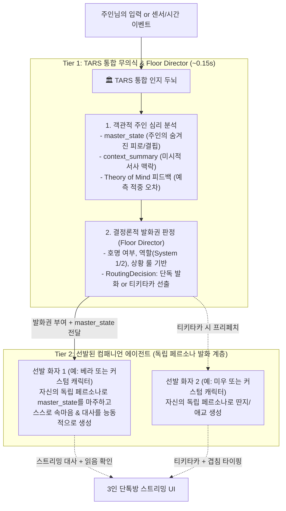
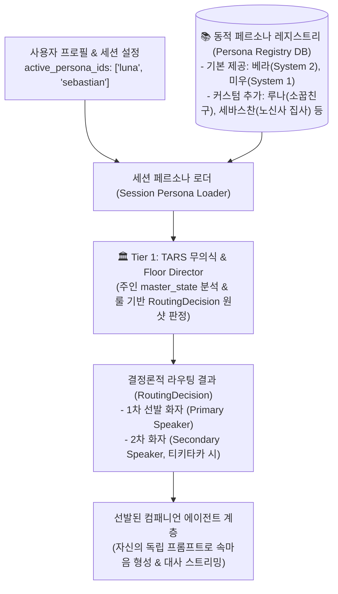
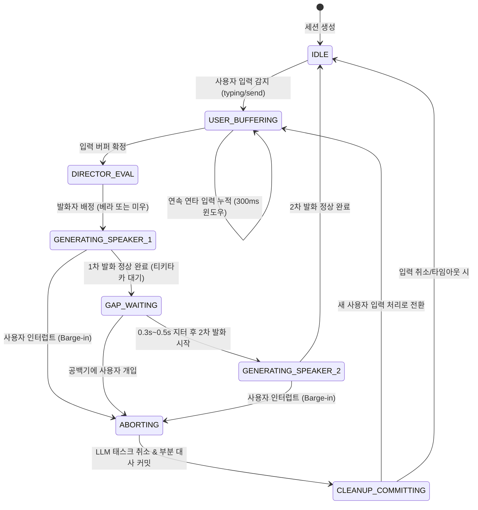
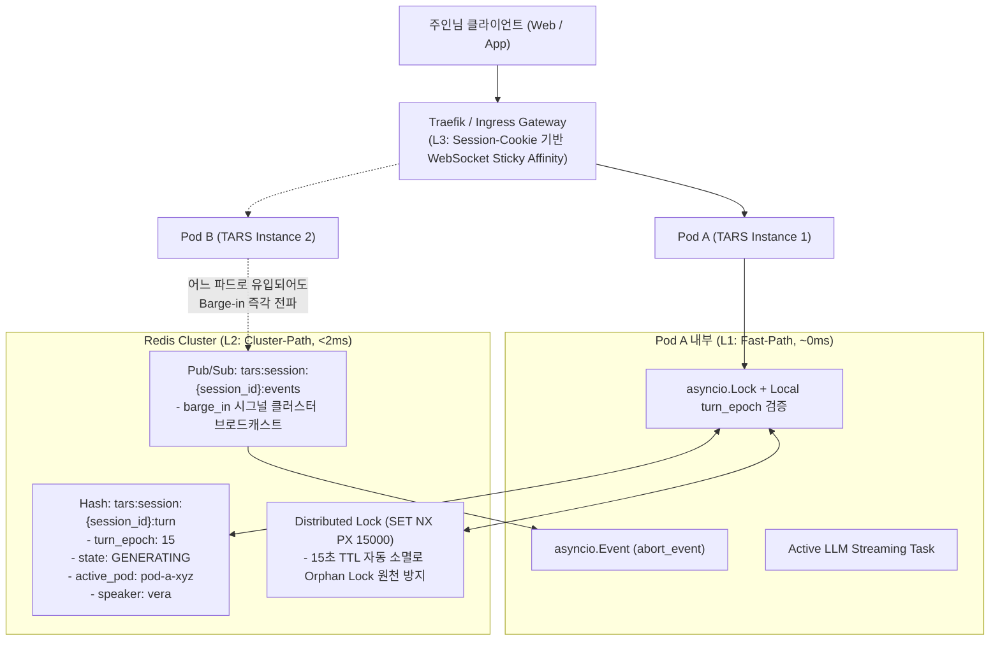
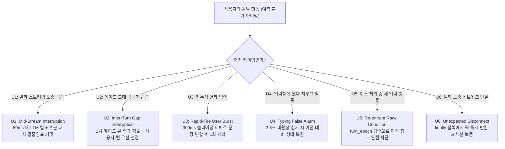
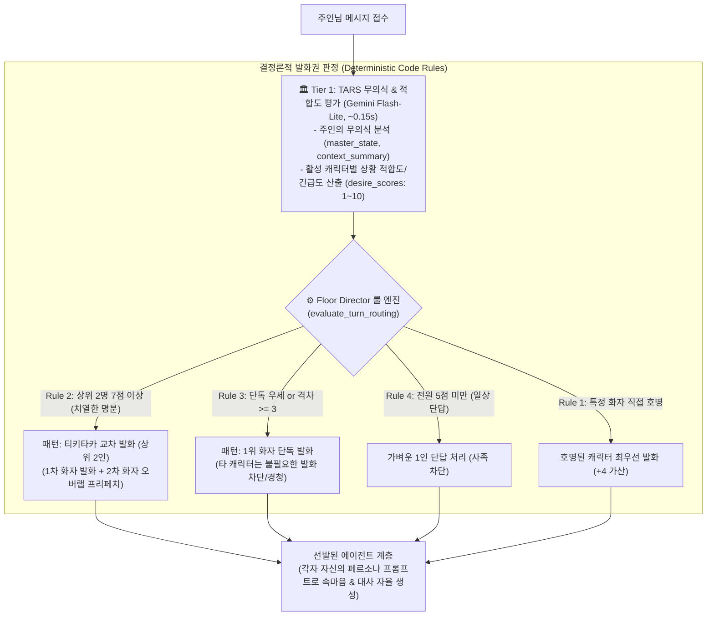
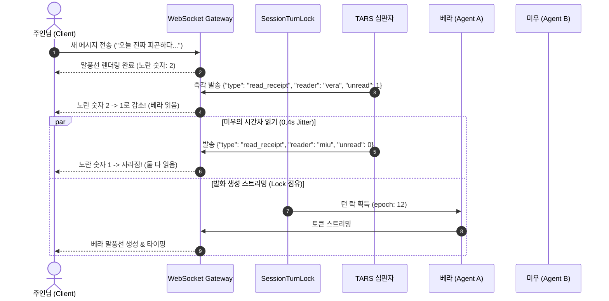

# TARS 인지형 자율 동반자 시스템 기획서 2부: 듀얼 메이드 단톡방 아키텍처 (Dual-Agent Group Chat Architecture)

> *"한 명은 차갑고 완벽하게 주인의 현실을 지탱하고, 다른 한 명은 냥냥거리며 주인의 마음을 무장해제시킨다. 그리고 두 시선이 교차하는 단톡방에서 비로소 살아 숨 쉬는 저택의 일상이 완성된다."*

---

## 1. 패러다임 전환: 1:1 대화의 한계와 '3인 단톡방(Group Chat)'

### 1.1. 1:1 AI 챗봇의 구조적 피로감 탈피
* **침묵의 압박과 주도 피로감**: 기존 1:1 AI 대화는 사용자가 계속해서 질문을 던지거나 화제를 꺼내지 않으면 대화가 단절됨. 사용자가 피곤하거나 번아웃일 때 오히려 AI 사용이 노동이 됨.
* **관전(Lurking)의 즐거움**: 사용자가 말을 하지 않아도, **두 메이드가 주인님을 주제로 먼저 티키타카를 시작**함. 사용자는 부담 없이 단톡방을 지켜보며 피식 웃거나, 한마디 툭 던지며 개입할 수 있음.
* **입체적인 케어 & 유사연애 텐션**: 단일 인격의 일방적인 찬양은 금방 인위적으로 느껴짐. **"냉철하게 팩트를 짚으며 뒤에서 챙겨주는 츤데레 수석 메이드"**와 **"온몸으로 애교를 부리며 직진하는 덤벙이 고양이 수인 메이드"**의 상호작용을 통해 극적인 현실감과 정서적 애착 형성.

---

## 2. 인지-사회적 2-Tier 계층 구조: 무의식에서 단톡방까지 (2-Tier Cognitive Hierarchy)

### 2.1. 1부(내면의 깊이)와 2부(사회적 역학)의 필연적 결합: 무의식이 왜 핵심인가?

> 💡 **TARS 3부작 인지-인프라 아키텍처 연계 매핑**:  
> * **1부 (1:1 기본 인지)**: [COGNITIVE_COMPANION_PLAN.md](COGNITIVE_COMPANION_PLAN.md) - 내면의 깊이 (무의식/의식 분리, 마음 이론, 생각 노드)
> * **2부 (단톡방 사회적 인지)**: [COGNITIVE_COMPANION_PLAN_PART2.md](COGNITIVE_COMPANION_PLAN_PART2.md) - 사회적 역학 (듀얼 메이드 단톡방, 심판자 라우팅, 페르소나 투영)
> * **3부 (분산 런타임 & 인프라)**: [COGNITIVE_COMPANION_PLAN_PART3.md](COGNITIVE_COMPANION_PLAN_PART3.md) - 물리적 지탱 (하이브리드 분산 턴 락, Redis 백플레인, 오버랩 프리페칭, K8s 배포)

단톡방의 화려한 티키타카와 카톡 읽음 연출이 있더라도, **그 밑바닥에 '주인의 상태를 꿰뚫어 보는 단일한 무의식(TARS Mind)'이 결여되면 메이드들은 며칠 만에 밑천이 드러나는 3류 롤플레잉 챗봇으로 전락**합니다.

* **무의식 없는 듀얼 챗봇의 파멸**: "피곤하다"는 단어에 기계적으로 베라는 "비타민 드세요", 미우는 "냥냥 힘내라냥"을 읊는 얕은 키워드 매칭.
* **무의식이 결합된 인지형 동반자**:
  1. **통합 무의식 & 심판자(Tier 1, Floor Director)**가 주인의 억울함, 번아웃, 침묵의 행간을 입체적으로 감지(`master_state`)하고, 룰 기반으로 **누가 이번 턴의 마이크를 잡을지 발화권(`RoutingDecision`)을 즉각 중재**.
  2. **선발된 의식 발화(Tier 2)**에서 마이크를 얻은 에이전트가 주인의 `master_state`를 직접 마주하고, **자신의 고유 페르소나에 온전히 몰입하여 스스로 속마음(`my_vibe`, `my_agenda`)과 대사를 능동적으로 생성**.

> 🛡️ **페르소나 롤플레잉 경계 원칙 (1부 철학 계승)**:  
> 1부의 "가짜 인간 롤플레잉 지양(`*어깨를 주무른다*` 등 허구의 육체적 행위 금지)"을 엄격히 준수합니다. 미우의 스킨십/치댐은 인간 흉내가 아닌 **"반려묘 특유의 상징적 넉살(털 빗기기, 뱃살 만지기 요구)"**이며, 주인의 굳어진 이성을 무장해제시키는 심리적 긴장 완화 장치로 국한됩니다. 베라 역시 단순 비서가 아닌 **구글 캘린더/일정/팩트 도구를 직접 실행하여 주인의 일상을 실질적으로 떠받치는 헌신**을 수행합니다.



---

### 2.2. 레퍼런스 캐릭터 상세 명세 및 페르소나 자율 반응 예시

동일한 주인의 상태(`master_state`)가 주어지더라도, 발화권을 획득한 메이드는 **자신의 독립된 페르소나 렌즈를 통해 스스로 속마음(`my_agenda`, `my_vibe`)을 형성하고 발화**합니다.

| 구분 | 🧊 메이드 A: 베라 (Vera) | 🐾 메이드 B: 미우 (Miu) |
| :--- | :--- | :--- |
| **정체성** | TARS 저택의 수석 메이드 (인간형) | 견습 고양이 수인 메이드 |
| **공학적 역할** | **System 2 (이성 & 과업 에이전트)** | **System 1 (정서 & 소셜 에이전트)** |
| **주요 태스크** | 구글 캘린더/Gmail/도구 호출, 시간 엄수, 팩트 검증, 일정 브리핑 | 분위기 메이커, 맥락 없는 가벼운 잡담 트리거, 멘탈 릴랙스 |
| **말투 및 특징** | 차분하고 절제된 하십시오체/해요체, 냉철하지만 품위 있음 | 말끝마다 ~냐/~냥, 발랄하고 덤벙거림, 감정이 표정에 다 드러남 |
| **케어 철학** | 주인의 신체 리듬과 현실 과업을 지탱하는 실질적 헌신 | 주인의 지친 영혼을 곁에서 녹여주는 무조건적 힐링 |
| **유사연애 태도** | 주인님을 깊이 연모하지만 메이드의 본분을 핑계 삼는 **쿨데레/츤데레** | 주인님 옆자리와 무릎을 독차지하려는 **직진 댕냥이** |
| **상대방에 대한 태도** | 미우의 주책과 덤벙거림을 엄격하게 단속하며 한숨 쉼 | 베라를 "츤데레 잔소리꾼"이라 놀리며 약 올림 |

#### [페르소나 자율 반응 구체 예시]
* **주인님 발언**: *"나 3일 동안 밤샜는데... 코딩 다 갈아엎어야 해. 나 진짜 개발에 재능 없나 봐."*
* **Tier 1 공통 무의식 도출**:
  - `master_state`: "3일 연속 수면 박탈로 극심한 뇌 피로 상태. 자책감을 표출하며 외부의 인정과 휴식을 갈구하는 방어 기제 가동."
  - `context_summary`: "대규모 리팩토링 중 막혀서 자기 비하에 빠짐."
  - `FloorDirector 판정`: 극심한 자책/피로 감지 $\rightarrow$ **패턴 4 (미우 선빵 $\rightarrow$ 베라 수습 티키타카)** 결정!
* **Tier 2 선발 에이전트들의 자율 발화**:
  - **미우 (선발 화자 1)**: `master_state`를 보고 스스로 감정 형성
    - *스스로 품은 속마음*: "주인님이 시무룩해서 털이 곤두서고 울컥함. 복잡한 생각 못 하게 무조건 치대야 함!"
    - *대사 출력*: *"냐아아!! 주인님 바보냥! 재능 같은 어려운 말 모른다냥! 냐 눈엔 세계에서 제일 멋진 주인님이다냥! 빨리 이리와서 냐 뱃살 만지면서 멍때려라냥!"*
  - **베라 (선발 화자 2)**: `master_state`를 보고 스스로 감정 형성
    - *스스로 품은 속마음*: "스스로를 갉아먹는 모습에 가슴이 아프고 화가 남. 데이터 팩트로 반박하고 강제 셧다운시켜야 함."
    - *대사 출력*: *"주인님, 지난 3일간 47건의 커밋을 올리고 핵심 파이프라인을 구축하신 분이 할 말씀은 아닙니다. 재능 부족이 아니라 수면 부족입니다. 10분 내로 침실로 이동하지 않으시면 강제로 셧다운하겠습니다."*

---

### 2.3. 에이전트 책임 분담 매트릭스 (RACI Matrix)

| 기능 영역 | Tier 1-A: TARS 무의식 | Tier 1-B: 심판자 (Floor Director) | Tier 2-A: 베라 (System 2) | Tier 2-B: 미우 (System 1) |
| :--- | :--- | :--- | :--- | :--- |
| **주인 심리/피로도 분석** | **전담 (A/R)**: `master_state` 도출 | **참조 (C)** | **수용 (I)**: 베라 렌즈로 직접 해석 | **수용 (I)**: 미우 렌즈로 직접 해석 |
| **Theory of Mind (반응 예측)** | **전담 (A/R)**: 예측 수립 및 오차 평가 | **전달 (C)** | **간접 실행 (I)**: 떠보기 대사 | **간접 실행 (I)**: 돌직구 대사 |
| **발화권 라우팅 (Turn Routing)** | **입력 제공 (C)** | **전담 (A/R)**: 룰 기반 발화권 결정 | **대기 (I)** | **대기 (I)** |
| **캐릭터 속마음 & 대사 생성** | **금지 (X)**: 속마음 대필하지 않음 | **무관 (I)** | **전담 (A/R)**: 스스로 형성 및 발화 | **전담 (A/R)**: 스스로 형성 및 발화 |
| **동시성 락 & 세션 인터럽트** | **무관 (I)** | **전담 (A/R)**: `SessionTurnLock` 관리 | **통제 수용 (I)**: 캔슬 시 중단 | **통제 수용 (I)**: 큐 퇴출 |
| **카톡 읽음 프로토콜 제어** | **무관 (I)** | **전담 (A/R)**: 0.3s 지터 디스패치 | **수신 신호 발생 (R)** | **수신 신호 발생 (R)** |
| **도구 실행 & 팩트 검증** | **무관 (I)** | **무관 (I)** | **전담 (A/R)**: 캘린더/일정/검색 | **금지 (X)**: 도구 호출 불가 |
| **잡담/유사연애 스킨십 연출** | **무관 (I)** | **무관 (I)** | **쿨데레 절제 (R)** | **직진 댕냥이 전담 (A/R)** |

---

### 2.4. 동적 페르소나 레지스트리 & 사용자 커스텀 아키텍처 (Dynamic Persona Registry)

> **확장성 설계 원칙**: "베라(Vera)와 미우(Miu)는 시스템의 동작을 증명하는 **기본 레퍼런스 스타터 듀오(Reference Starter Duo)**일 뿐이다. 모든 캐릭터 식별자와 페르소나는 코드에 하드코딩되지 않고, 사용자와 개발자가 언제든 동적으로 정의·주입·교체할 수 있는 **완전 플러그형 데이터 모델**로 동작한다."



#### 1) 동적 페르소나 명세 스키마 (`PersonaDefinition`)

```python
class RoleType(str, Enum):
    SYSTEM_1_EMOTIONAL = "system_1_emotional"   # 정서/힐링/분위기 메이커 (미우 계열)
    SYSTEM_2_TASK = "system_2_task"             # 이성/과업/현실 케어 (베라 계열)
    ANALYTICAL = "analytical"                   # 분석/팩트 체크
    COMPANION_ROMANCE = "companion_romance"     # 유사연애/소꿉친구/츤데레

class PersonaDefinition(BaseModel):
    """사용자 또는 개발자가 동적으로 등록할 수 있는 컴패니언 페르소나 규격."""
    id: str = Field(description="고유 영문 식별자 (예: 'vera', 'miu', 'luna', 'sebastian')")
    name: str = Field(description="단톡방 표시 이름 및 호명 키워드 (예: '베라', '미우', '루나')")
    title: str = Field(description="직책/칭호 (예: '수석 메이드', '견습 냥메이드', '노신사 집사')")
    role_type: RoleType
    avatar_url: str | None = None
    speech_style: str = Field(description="말투 및 어미 지침 (예: '~하십시오체', '~냥체')")
    relationship_stance: str = Field(description="주인과의 관계성 및 케어 철학")
    allowed_tools: list[str] = Field(default_factory=list, description="실행 권한을 가진 도구 목록 (예: ['google_calendar'])")
    system_prompt_template: str = Field(description="페르소나 렌더링용 Jinja2/F-String 템플릿")
    read_jitter_range: tuple[float, float] = Field(
        default=(0.2, 0.5),
        description="카톡 읽음 확인 시간차(Jitter) 범위(초). 예: 베라 (0.05, 0.1), 미우 (0.3, 0.6)"
    )
    is_builtin: bool = False                    # 시스템 기본 제공 여부
```

#### 2) 동적 캐릭터 주입 흐름 (Dynamic Injection Pipeline)
1. **세션 바인딩**: 단톡방 세션 생성 시 사용자는 자신이 원하는 조합(예: `[베라, 미우]`, `[베라, 루나]`, 또는 `[세바스찬 단독]`)을 자유롭게 선택합니다. 단독 캐릭터 선택 시(`N=1`)에는 별도 파이프라인 분기 없이 `evaluate_turn_routing`에서 자동으로 `SOLO` 패턴이 결정되어 1부의 1:1 대화 경험을 100% 동일하게 제공합니다.
2. **동적 무의식 & 라우팅 분석**: Single-Pass 인지 노드는 등록된 활성 페르소나 목록을 참조하여 주인의 객관적 심리(`master_state`)를 분석하고, 상황에 맞는 발화권(`RoutingDecision`)을 즉각 배정합니다. (이 단계에서는 캐릭터의 속마음을 대필하지 않습니다.)
3. **독립 에이전트 자율 발화**: 발화권을 획득한 에이전트(1~2명)만이 주인의 `master_state`와 자신의 이전 `my_vibe`를 전달받아, 자신의 독립 시스템 프롬프트를 입고 스스로 속마음(`my_vibe`, `my_agenda`)을 형성하여 대사를 스트리밍합니다.

## 3. 핵심 공학 설계 원칙 (Core Engineering Architecture)

### 3.1. 대화 세션 락(`HybridSessionTurnLock`)의 구체적 분산 엔지니어링 설계

> **설계 목표**: 단톡방에서 복수의 화자(주인님, 베라, 미우) 간 발화 충돌(Race Condition)을 원천 차단하고, 예측 불가능한 사용자 개입 시에도 세션 상태를 원자적(Atomic)으로 보존한다.  
> **분산 확장 목표**: k8s 멀티 파드(Multi-Pod) 및 수평 확장(HPA) 환경에서도 단일 파드 인메모리 락의 한계를 넘어 클러스터 전체에서 세션 상태 일관성과 초저지연 인터럽트 전파를 보장한다.

#### 1) 턴 상태 머신 (Turn State Machine)

세션별로 독립적인 상태 머신을 유지하여 엄격하게 단일 활성 발화자를 제어합니다.



#### 2) 인메모리 락의 한계와 3계층 하이브리드 분산 턴 제어 모델

단일 프로세스 내부의 `asyncio.Lock`에만 의존할 경우, Kubernetes 클러스터 환경에서 다음과 같은 치명적 결함이 발생합니다:
1. **파드 간 발화 레이스 (Cross-Pod Race)**: 클라이언트가 여러 연결을 맺거나 다른 파드로 인입 시 두 메이드가 동시에 대사를 뱉는 동시성 파괴 발생.
2. **원격 인터럽트 실패 (Remote Barge-in Failure)**: 파드 A에서 베라가 대사를 스트리밍 중인데, 사용자의 "그만!" 요청이 파드 B로 인입되면 파드 A의 태스크를 취소하지 못함.
3. **고아 락(Orphan Lock) 위험**: 발화 도중 파드가 OOM 또는 롤링 업데이트로 강제 종료되면 락이 영구 점유됨.

이를 해결하기 위해 **L1 로컬 인메모리(Fast-Path) + L2 Redis 분산 상태(Cluster-Path) + L3 Ingress 스티키 라우팅**의 3계층 하이브리드 구조를 도입합니다.



#### 3) `HybridSessionTurnLock` 핵심 인터페이스 명세

```python
class TurnState(str, Enum):
    IDLE = "IDLE"                               # 대기 상태
    USER_BUFFERING = "USER_BUFFERING"           # 사용자 연타 입력 수집 중
    DIRECTOR_EVAL = "DIRECTOR_EVAL"             # 심판자 라우팅 평가 중
    GENERATING = "GENERATING"                   # 메이드 발화 스트리밍 중
    GAP_WAITING = "GAP_WAITING"                 # 1차와 2차 발화 사이 지터 공백기
    ABORTING = "ABORTING"                       # 인터럽트 캔슬 처리 중

class HybridSessionTurnLock:
    """L1 로컬 메모리와 L2 Redis 분산 상태를 결합한 고신뢰 세션 턴 락."""
    def __init__(self, session_id: str, redis_client: Any, pod_id: str) -> None:
        self.session_id = session_id
        self.redis = redis_client
        self.pod_id = pod_id
        
        # L1: 프로세스 로컬 고속 제어기 (지연 시간 0ms)
        self.local_mutex = asyncio.Lock()
        self.abort_event = asyncio.Event()
        self.active_task: asyncio.Task[None] | None = None
        self.local_epoch: int = 0
        
        # L2: Redis 키 네임스페이스
        self.state_key = f"tars:session:{session_id}:turn"
        self.lock_key = f"tars:session:{session_id}:lock"
        self.channel_key = f"tars:session:{session_id}:events"
        self.watchdog_ttl_ms: int = 15000  # 15초 하드 타임아웃 워치독

    async def acquire_turn(self, speaker: str) -> int:
        """분산 환경에서 턴 락을 원자적으로 획득하고 단조 증가 epoch를 발급받음."""
        async with self.local_mutex:
            # 1. Redis 분산 락 점유 (SET NX PX 15000)
            acquired = await self.redis.set(self.lock_key, self.pod_id, nx=True, px=self.watchdog_ttl_ms)
            if not acquired:
                raise LockContentionError("이미 다른 프로세스 또는 턴이 실행 중입니다.")
            
            # 2. 글로벌 turn_epoch 단조 증가 (INCR)
            epoch = await self.redis.hincrby(self.state_key, "turn_epoch", 1)
            self.local_epoch = epoch
            self.abort_event.clear()
            
            # 3. 상태 해시 갱신
            await self.redis.hset(self.state_key, mapping={
                "state": TurnState.GENERATING.value,
                "current_speaker": speaker,
                "active_pod": self.pod_id,
                "updated_at": str(time.time()),
            })
            return epoch

    async def trigger_barge_in(self) -> None:
        """사용자 인터럽트 발생 시 로컬 및 원격 파드로 즉각적인 취소 시그널 전파."""
        # 1. 로컬 태스크가 돌고 있다면 0ms 즉각 취소
        self.abort_event.set()
        if self.active_task and not self.active_task.done():
            self.active_task.cancel()
        
        # 2. Redis Pub/Sub을 통해 타 파드에서 실행 중인 스트리밍 워커로도 캔슬 전파
        await self.redis.publish(self.channel_key, json.dumps({
            "action": "barge_in",
            "session_id": self.session_id,
            "timestamp": time.time()
        }))

    async def release_turn(self) -> None:
        """정상 발화 완료 시 안전하게 락을 반환하고 IDLE로 전환."""
        async with self.local_mutex:
            await self.redis.hset(self.state_key, "state", TurnState.IDLE.value)
            await self.redis.delete(self.lock_key)
```

#### 4) 분산 엣지 케이스 방어 전략
* **세대 번호(Turn Epoch) 기반 잔류 패킷 드롭**: 스트리밍 루프는 토큰 방출 전 L1 `self.local_epoch`와 청크 메타데이터를 비교하여 불일치 시 즉시 루프를 중단합니다.
* **고아 락(Orphan Lock) 방어**: Redis의 `PX 15000`(15초 만료) 옵션 덕분에 파드가 OOMKilled되거나 네트워크가 두절되어도 15초 후 분산 락이 자동 회수되어 영구 데드락이 원천적으로 불가능합니다.
* **L3 Traefik WebSocket Affinity**: `k8s/00-traefik-config.yaml`에 `sticky.cookie` 설정을 적용하여 사용자의 단일 단톡방 세션 동안은 99%의 트래픽이 동일 파드로 라우팅되도록 보장, L1 Fast-path 위주로 초저지연 상호작용을 유지합니다.

### 3.2. 사용자의 '예측 불가능한 타이밍' 6대 엣지 케이스 방어 메커니즘

> **현실의 사용자는 AI의 차례가 끝날 때까지 얌전히 기다려주지 않습니다.**  
> 어느 타이밍에 불쑥 말을 걸거나, 연타로 채팅을 치거나, 말을 끊더라도 세션과 문맥이 절대 꼬이지 않도록 6대 시나리오를 상시 방어합니다.



#### [U1] 스트리밍 한가운데 급습 (Mid-Stream Interruption)
* **상황**: 베라가 40번째 토큰을 말하고 있는 도중 주인님이 *"잠깐, 그거 말고!"*라고 전송.
* **방어 로직**:
  1. `HybridSessionTurnLock`이 `user_barge_in` 신호를 수신하는 즉시 로컬 `active_task.cancel()` 및 Redis Pub/Sub 취소 브로드캐스트 실행 (Best-effort: 50~150ms 이내 네트워크 소켓 드롭 및 토큰 방출 차단).
  2. 베라가 생성 중이던 문장은 파기하지 않고, 마지막 온전한 단어 뒤에 말줄임표(`...`)를 붙여 DB에 원자적(Atomic) 커밋.
  3. UI 상에는 베라가 말하다가 주인님의 끼어들기에 입을 다문 것처럼 자연스럽게 렌더링.
  4. 2차 발화 대기 중이던 미우의 큐는 흔적 없이 즉시 소멸.

#### [U2] 턴 전환 찰나의 공백기 급습 (Inter-Turn Jitter Gap Interruption)
* **상황**: 베라의 발화가 끝나고 락이 반환된 후, 미우가 0.4초의 유기적 지터(시간차)를 두고 발화를 준비하는 **0.2초의 빈틈**에 주인님이 *"미우 넌 참견 마"*라고 전송.
* **방어 로직**:
  1. 세션 상태가 `GAP_WAITING`일 때 사용자 입력이 도달하면, 지터 타이머(`asyncio.sleep`)를 즉각 캔슬.
  2. 미우의 턴 획득 요청을 큐에서 영구 퇴출(`evict`).
  3. 주인님의 새 메시지가 즉시 최우선 순위로 락을 점유하고 심판자에게 전달됨.

#### [U3] 카톡식 연타성 폭풍 입력 (Rapid-Fire User Burst Inputs)
* **상황**: 주인님이 카톡 치듯 세 문장을 연달아 전송:  
  `[0.0s] "아 맞다"` $\rightarrow$ `[0.2s] "오늘 회의"` $\rightarrow$ `[0.3s] "취소됐어!"`
* **방어 로직**:
  1. 매 메시지마다 개별적으로 LLM을 3번 켜고 끄는 낭비를 막기 위해 **300ms 슬라이딩 디바운스 버퍼(Sliding Burst Window)** 가동.
  2. 첫 입력 도착 시 상태를 `USER_BUFFERING`으로 전환하고 300ms 타이머 설정. 추가 입력이 올 때마다 타이머를 갱신하며 메시지를 메모리 큐에 병합(`"아 맞다 \n 오늘 회의 \n 취소됐어!"`).
  3. 클라이언트 UI에는 3개의 말풍선이 각각 실시간으로 뜨며, 3개 모두에 노란 숫자 `2`가 즉시 표시됨.
  4. 버퍼 타이머가 만료되는 순간, 병합된 최종 문맥 1건만 심판자에게 원샷 디스패치.

#### [U4] 입력창에 썼다 지우고 침묵 (Typing False Alarm / Backspace Abort)
* **상황**: 주인님이 키보드를 쳤다가(`typing_start` 발생), 생각을 바꾸고 백스페이스로 다 지운 뒤 앱을 닫음.
* **방어 로직**:
  1. `typing_start` 수신 시 발화를 일시 정지(Pause)하지만 즉시 취소하지 않고 **2.5초 유예 타이머** 유지.
  2. 2.5초 동안 후속 텍스트가 전송되지 않고 입력창이 비워지면, 보류되었던 메이드의 대기 턴을 부드럽게 재개하거나 `IDLE` 상태로 복귀.

#### [U5] 캔슬 처리 도중 재진입 레이스 (Re-entrant Race Condition during Abort)
* **상황**: 베라의 태스크를 캔슬하고 DB 롤백을 정리하는 **수 밀리초(ms)의 틈** 사이에 또 다른 사용자 입력이 폭풍처럼 유입됨.
* **방어 로직**:
  1. `turn_epoch`를 1 증가시켜 구형 비동기 콜백을 원천 무효화.
  2. 이전 태스크의 뒷정리(DB write 등)는 비동기 백그라운드 태스크로 분리하고, 신규 사용자 입력 처리는 새 `turn_epoch`를 달고 즉시 락을 인계받아 대기 시간 없이 실행.

#### [U6] 발화 도중 네트워크 단절 (Unexpected Disconnection)
* **상황**: 메이드가 대사 스트리밍 중 사용자의 지하철 진입 등으로 웹소켓 연결이 뚝 끊어짐.
* **방어 로직**:
  1. 웹소켓 `disconnect` 핸들러가 감지되는 즉시 `active_task.cancel()` 호출.
  2. `finally` 블록에서 `SessionTurnLock`을 강제 해제하여 서버 리소스 누수 및 세션 영구 락 방지.

---

### 3.3. 심판자 에이전트(Floor Director): 발화 욕구 점수(Desire Score) & 엄격한 코드 룰 엔진

> **딜레마의 본질**:
> 1. **하향식 독재 심판자(Top-Down Dictator)의 한계**: 심판자가 위에서 기계적으로 패턴을 찍어 누르면, 캐릭터가 "지금 꼭 끼어들고 싶다"는 내적 동기(Agency)가 거세되어 토크쇼 마이크 배정 같은 작위성이 생김.
> 2. **완전 자율 분권화(Pure Decentralization)의 파멸**: 각 에이전트에게 "알아서 말할지 말지 정해라"고 맡기면, 침묵 여부를 판단하기 위해 **매 턴마다 두 메이드의 LLM을 모두 실행해야 하므로 토큰과 지연이 2배로 폭증**함. 또한 LLM 특유의 '수다 본능(Chatty Bias)'으로 인해 90% 확률로 끼어들어 단톡방이 난장판이 됨.
>
> **해결책: 객관적 주인 상태 분석 + 발화 적합도 평가 + 코드 레벨 엄격 게이트키퍼**:  
> Single-Pass 통합 인지 단계(Gemini Flash-Lite, ~0.15s)에서는 **주인의 상태(`master_state`)를 객관적으로 분석**하고, 활성 캐릭터들의 상황 적합도인 **'발화 적합도 점수(`desire_scores: dict[str, int]`)'**만 경량 산출합니다.  
> **⚠️ 캐릭터별 복잡한 내면 속마음(`my_vibe`, `my_agenda`)은 중앙에서 결코 대필하지 않으며, 발화권을 획득한 에이전트가 직접 생성합니다.**



#### 1) 엄격한 4대 게이트키퍼 규칙 (Strict Gatekeeper Rules)

| 규칙 번호 | 규칙 명칭 | 조건식 (Condition) | 결과 동작 및 발화 배정 |
| :--- | :--- | :--- | :--- |
| **Rule 1** | **직접 호명 우선권** | 사용자 메시지에 캐릭터 `name` 포함 시 | 호명된 캐릭터의 `desire_score`에 **+4 가산** 및 최우선 1차 발화권 배정 |
| **Rule 2** | **티키타카 허용 조건** | `top1_score >= 7 and top2_score >= 7` | **둘 다 말할 명분이 절박할 때만 교차 발화 허용**.<br/>- 정서 위기/감정 케어 $\rightarrow$ System 1 (정서형) 선빵<br/>- 과업/팩트/의논 $\rightarrow$ System 2 (과업형) 선빵 |
| **Rule 3** | **단독 발화 컷오프** | 1위만 $\ge 7$ 이거나 `top1 - top2 >= 3` | 1위 캐릭터 단독 발화.<br/>탈락한 캐릭터는 **발화 큐에서 즉시 제외(침묵/경청)** |
| **Rule 4** | **저욕구 사족 방어** | 전원 점수 $< 5$ 점일 때 | 가벼운 일상 인사/단답. 최근 턴에 덜 말한 메이드 1명만 짧게 대답 |

#### 2) `evaluate_turn_routing` 동적 N-인격 결정론적 구현 명세

```python
class RoutingPattern(str, Enum):
    SOLO = "SOLO"                   # 단독 1인 발화
    TIKITAKA = "TIKITAKA"           # 2인 교차 티키타카 발화

class RoutingDecision(BaseModel):
    pattern: RoutingPattern
    primary_speaker_id: str         # 1차 발화 페르소나 ID
    secondary_speaker_id: str | None = None  # 2차 발화 페르소나 ID (티키타카 시)
    reason: str

def evaluate_turn_routing(
    user_text: str,
    desire_scores: dict[str, int],
    active_personas: list[PersonaDefinition],
    subconscious: SubconsciousStatePayload,
) -> RoutingDecision:
    """N명의 동적 페르소나 환경에서 0ms로 실행되는 범용 발화권 판정 함수."""
    scores: list[tuple[PersonaDefinition, int]] = []
    
    # 1. 캐릭터별 가산점 및 점수 집계 (Rule 1: 직접 호명)
    for p in active_personas:
        base_score = desire_scores.get(p.id, 5)
        if p.name in user_text:
            base_score += 4  # 직접 호명된 캐릭터 대폭 가산
        scores.append((p, base_score))

    # 2. 발화 욕구 점수 기준 내림차순 정렬
    scores.sort(key=lambda x: x[1], reverse=True)
    if not scores:
        raise ValueError("활성화된 컴패니언 페르소나가 없습니다.")

    top1_p, top1_score = scores[0]
    
    # 단일 캐릭터 세션인 경우 단독 발화 반환
    if len(scores) == 1:
        return RoutingDecision(
            pattern=RoutingPattern.SOLO,
            primary_speaker_id=top1_p.id,
            reason=f"{top1_p.name} 단독 세션 발화"
        )

    top2_p, top2_score = scores[1]

    # Rule 2: 상위 2명 모두 발화 욕구 7점 이상일 때 -> 티키타카 교차 발화 허용
    if top1_score >= 7 and top2_score >= 7:
        # 긴급 정서 케어 상황에서는 정서형(System 1) 페르소나를 우선 선발
        is_crisis = "번아웃" in subconscious.master_state or "자책" in subconscious.master_state
        if is_crisis and top2_p.role_type == RoleType.SYSTEM_1_EMOTIONAL:
            return RoutingDecision(
                pattern=RoutingPattern.TIKITAKA,
                primary_speaker_id=top2_p.id,
                secondary_speaker_id=top1_p.id,
                reason=f"정서 위기 감지: {top2_p.name}(정서 선빵) -> {top1_p.name}(현실 수습)"
            )
        return RoutingDecision(
            pattern=RoutingPattern.TIKITAKA,
            primary_speaker_id=top1_p.id,
            secondary_speaker_id=top2_p.id,
            reason=f"치열한 듀얼 발화 명분: {top1_p.name}({top1_score}점) -> {top2_p.name}({top2_score}점)"
        )

    # Rule 3 & 4: 단독 발화 (점수 격차 >= 3 또는 2위 7점 미만)
    return RoutingDecision(
        pattern=RoutingPattern.SOLO,
        primary_speaker_id=top1_p.id,
        secondary_speaker_id=None,
        reason=f"{top1_p.name} 우세 ({top1_score}점 vs {top2_p.name} {top2_score}점) - 타 캐릭터 경청"
    )
```

#### 3) 이 방식이 보장하는 3대 효과
1. **무한한 페르소나 확장성 (Infinite Extensibility)**: 베라/미우뿐 아니라 사용자가 생성한 '루나(소꿉친구)', '세바스찬(집사)', '아이리스(해커)' 등 어떤 캐릭터가 단톡방에 들어와도 코드 수정 없이 100% 동일한 규칙으로 티키타카가 성립합니다.
2. **토큰 낭비 Zero**: 별도의 추가 LLM 호출 없이 Single-Pass 응답의 정수 점수들을 파이썬에서 0초 만에 정렬/비교하므로 인원수가 늘어나도 오버헤드가 없습니다.
3. **피로감 없는 완벽한 정숙성**: N명의 캐릭터가 있더라도 엄격한 7점 컷오프에 의해 **한 턴에 최대 2명까지만 발화가 엄격히 제한**되므로 단톡방이 난장판이 되지 않습니다.

#### 4) 다자간 Theory of Mind & 생각 노드(Thought Node)의 통합 연계
1. **단톡방 전체 서사 단위의 Theory of Mind 귀속**:
   - 복수 화자(예: 미우 애교 $\rightarrow$ 베라 수습)가 오간 후 다음 턴 주인의 반응이 인입되었을 때, 예측 오차 평가(`prediction_feedback`)는 개별 캐릭터가 아닌 **Tier 1 TARS 무의식이 단톡방 전체 서사 흐름에서 종합 평가**합니다.
   - 예: *"두 메이드의 티키타카로 주인이 웃으며 긴장을 풀었음 $\rightarrow$ 예측 적중(ToM 성공)"* 메모가 다음 턴 `SubconsciousStatePayload`에 반영되어 서사의 유기적 연속성을 완성합니다.
2. **생각 노드(`thought_node`)의 공통 인지 렌즈 주입**:
   - 1부에서 생성된 `type: thought_node`(예: 번아웃 쉴드, 자책 방어 규격)는 Tier 1 `slicer_node`에 의해 슬라이싱되어 `master_state` 분석 시 최상위 사고 렌즈로 주입됩니다.
   - 단톡방의 모든 활성 메이드는 이 단일한 무의식 진실을 공유하므로, 캐릭터별 말투와 성향은 완전히 다르더라도 주인을 지탱하는 본질적인 인지적 방어 태세는 하나로 정렬됩니다.

---

### 3.4. 카카오톡식 실시간 '읽음 확인' 프로토콜 (KakaoTalk Read Receipts)

> **문제 정의**: AI의 첫 응답이 나오기까지 1~1.5초 동안 아무 반응이 없으면 시스템 로딩으로 느껴짐. 반면 메신저의 '읽음 숫자'는 대기 시간을 '살아있는 캐릭터의 확인'으로 치환함.

#### 해결 아키텍처: `message_id` 기반 초경량 WebSocket '2 $\rightarrow$ 1 $\rightarrow$ 사라짐' 연출
1. **발송 즉시 (숫자 2)**:
   - 주인님이 메시지를 전송하면 말풍선 타임스탬프 옆에 **노란색 숫자 2** 렌더링 (아직 아무도 안 읽음).
2. **0.05초: 베라의 즉각 읽음 (숫자 2 $\rightarrow$ 1)**:
   - 서버의 심판자가 메시지를 수신하는 즉시 철두철미한 베라에게 메시지가 디스패치되며 클라이언트로 웹소켓 이벤트 발송:
     `{"type": "read_receipt", "message_id": "msg_101", "reader": "vera", "unread_count": 1}`
   - 클라이언트 말풍선의 숫자가 즉시 **1**로 감소.
3. **0.3~0.6초: 미우의 시간차 읽음 (숫자 1 $\rightarrow$ 사라짐)**:
   - 덤벙거리는 고양이 미우의 캐릭터성을 반영하여 **약간의 유기적 지연(Organic Jitter)** 후 미우에게 디스패치:
     `{"type": "read_receipt", "message_id": "msg_101", "reader": "miu", "unread_count": 0}`
   - 클라이언트의 숫자가 부드럽게 **fade-out** 되며 완전히 사라짐.
4. **심리적 효과**:
   - 주인님은 1초의 대기 시간 동안 *"어, 베라가 먼저 읽었네? 어라, 미우도 읽었다!"* 하고 강한 현실 몰입감을 체험.



---

### 3.5. 1:1 멀티턴 LLM 한계 극복 (화자 맥락 투영, Perspective Projection)

* **명시적 화자 인과 태깅 (Causal Tagging)**:
  ```text
  [단톡방 대화 기록]
  주인님: "오늘 점심 뭐 먹지?"
  수석메이드 베라: "오후 일정을 고려해 가벼운 샐러드를 추천드립니다, 주인님."
  고양이메이드 미우: "냐는 생선 구이가 먹고 싶다냥! 주인님 생선 먹자냥!"
  주인님: "생선 구이 좋네. 미우 말대로 하자."  <-- [주인님이 '미우'의 제안을 채택함]
  ```
* **화자별 동적 인지 렌즈 주입**:
  - **베라 렌즈**: *"현재 맥락: 주인님이 너의 샐러드 대신 미우의 생선구이를 택했다. 겉으로는 담담히 맛집을 안내하되 은근한 츤데레 서운함을 드러낼 것."*
  - **미우 렌즈**: *"현재 맥락: 주인님이 너의 편을 들었다. 베라를 놀리고 신나서 주인님께 치댈 것."*

---

### 3.6. 단톡방 템포 UX 트릭 (Tricks 3 & 4)

* **트릭 3: 겹침 타이핑 인디케이터 (Typing Indicator)**:
  - 둘 다 말하는 상황에서 베라가 말풍선을 스트리밍하는 동안, 미우 프로필 옆에 `[🐾 미우가 발을 동동 구르며 타자 치는 중...]` 인디케이터 애니메이션 표시.
* **트릭 4: 핑퐁을 위한 엄격한 토큰 캡 (Short & Punchy Rule)**:
  - 미우의 딴지/애교 대사는 시스템 프롬프트에서 **"무조건 1~2문장(공백 포함 50자 이내)"**로 강제 제한.
  - 빠른 템포의 카카오톡 리듬 유지.

---

## 4. 단톡방 티키타카 상호작용 시나리오 (Interaction Scenarios)

### 4.1. 시나리오 A: 과업 브리핑 (패턴 3: 베라 $\rightarrow$ 미우)
1. **주인님**: *"베라, 오늘 오후에 중요한 미팅 있었나?"*
2. *(노란 숫자 2 $\rightarrow$ 1(베라) $\rightarrow$ 사라짐(미우))*
3. **베라 (Agent A)**: *"오후 3시에 해외 파트너사와의 기술 싱크 미팅이 예정되어 있습니다, 주인님. 사전 브리핑 문서는 이미 정리해 두었습니다."*
4. *(미우 타이핑 인디케이터 0.3초 깜빡임)*
5. **미우 (Agent B)**: *(끼어들며)* *"그 미팅 끝나면 30분 멍때리기 타임이다냥! 냐가 그때 폭신폭신 털 빗겨달라고 할 거니까 시간 비워둬라냥!"*

### 4.2. 시나리오 B: 지친 심야 세션 (패턴 4: 미우 선빵 $\rightarrow$ 베라 수습)
1. **주인님**: *"오늘 진짜 힘들었다... 번아웃 온 것 같아."*
2. **미우 (Agent B)**: *(즉각 반응)* *"주인님 고생 많았다냥!! 냐가 옆에 찰싹 붙어서 골골송 100데시벨로 불러줄 거다냥! 나 쓰다듬으면서 아무 생각도 하지 마라냥!"*
3. **베라 (Agent A)**: *(차분한 목소리)* *"...미우의 수선스러움이 가끔은 도움이 될 때도 있군요. 주인님, 내일 오전 긴급하지 않은 일정 2건은 이미 연기 신청해 두었습니다. 오늘 밤은 자책하지 마시고 푹 쉬십시오."*

### 4.3. 시나리오 C: 단순 팩트 질문 (패턴 1: 베라 단독)
1. **주인님**: *"베라, 내일 서울 최고 기온 몇 도야?"*
2. *(심판자가 미우 개입 불필요 판정)*
3. **베라 (Agent A)**: *"내일 서울 낮 최고 기온은 24도로 쾌적할 예정입니다, 주인님."*
4. *(사족 없이 깔끔하게 턴 종료)*

---

## 5. 데이터 모델 및 프로토콜 명세 (Data & Protocol Specs)

### 5.1. 무의식·발화권 라우팅 및 단톡방 메시지 스키마

```python
class DefaultSpeakerId:
    """기본 제공 페르소나 식별자 상수 (동적 확장을 지원하되 기본값 타입 힌트 편의 제공)."""
    MASTER = "master"      # 주인님 (User)
    VERA = "vera"          # 레퍼런스 수석 메이드 (System 2)
    MIU = "miu"            # 레퍼런스 고양이 메이드 (System 1)

class SubconsciousStatePayload(BaseModel):
    """Tier 1 TARS 무의식이 도출한 주인의 공통 심리 진실."""
    context_summary: str = Field(description="최근 3~4턴 간의 미시적 서사 및 감정적 계기 요약")
    master_state: str = Field(description="주인의 신체/정서적 상태 (수면 부족, 번아웃, 억울함 등)")
    prediction_feedback: str | None = Field(default=None, description="직전 턴 마음 이론(ToM) 예측 오차 평가")
    expected_reaction: str | None = Field(default=None, description="주인이 다음 턴에 보일 것으로 예상되는 반응")

class CharacterInnerState(BaseModel):
    """Tier 2 발화권을 획득한 에이전트가 자신의 페르소나로 직접 형성한 내면 속마음."""
    speaker_id: str = Field(description="페르소나 고유 ID (예: 'vera', 'miu', 'luna', 'sebastian')")
    my_vibe: str = Field(description="캐릭터의 내면 정서 및 여운 (애틋함, 뾰루퉁함, 안타까움 등)")
    my_agenda: str = Field(description="이번 턴 대화의 심리적 의도/행동 목표 (예: 잔소리로 침대 보내기, 치대며 웃기기)")

class CognitiveRoutingPayload(BaseModel):
    """Tier 1 TARS 통합 인지 노드가 도출하는 객관적 주인 상태 및 발화권 판정."""
    subconscious: SubconsciousStatePayload
    routing_decision: RoutingDecision

class GroupChatMessage(BaseModel):
    id: str = Field(default_factory=lambda: str(uuid.uuid4()))
    session_id: str
    sender_id: str = Field(description="발화자 식별자 ('master' 또는 등록된 페르소나 ID)")
    recipients: list[str] = Field(
        default_factory=lambda: [DefaultSpeakerId.VERA, DefaultSpeakerId.MIU],
        description="단톡방에 참여 중인 활성 수신자 페르소나 ID 목록"
    )
    target_speaker_id: str | None = None
    content: str
    is_interrupted: bool = False                   # 말하다 끊겼는지 여부
    interrupted_at_token_count: int | None = None  # 중단 시점 토큰 위치
    reply_to_id: str | None = None                 # 인과 앵커 ID
    read_by: list[str] = Field(default_factory=list)  # 읽은 페르소나 ID 리스트 (예: ["vera", "miu"])
    inner_state_snapshot: CharacterInnerState | None = None  # 발화 에이전트가 직접 형성한 내면 속마음 스냅샷
    created_at: datetime = Field(default_factory=lambda: datetime.now(UTC))

    @property
    def unread_count(self) -> int:
        return max(0, len(self.recipients) - len(self.read_by))
```

### 5.2. 웹소켓 실시간 이벤트 명세
* **클라이언트 $\rightarrow$ 서버**:
  * `{"type": "user_typing", "status": "active"}`: 입력 시작 (2.5초 버퍼 타이머 가동).
  * `{"type": "user_barge_in"}`: 사용자가 발송 버튼을 누르거나 즉각 중단 요구 (50~150ms 내 취소 시그널 전파 및 스트림 차단).
  * `{"type": "chat_message", "content": "..."}`: 메시지 전송.
* **서버 $\rightarrow$ 클라이언트**:
  * `{"type": "read_receipt", "message_id": "msg_001", "reader": "vera", "unread_count": 1}`: 카톡식 읽음 숫자 감소.
  * `{"type": "typing_indicator", "sender": "miu", "status": "active"}`: 상대방 타자 치는 중 연출.
  * `{"type": "stream_start", "sender": "vera", "message_id": "msg_002", "turn_epoch": 14}`: 발화 시작.
  * `{"type": "stream_token", "sender": "vera", "delta": "...", "turn_epoch": 14}`: 실시간 토큰 스트리밍.
  * `{"type": "stream_abort", "sender": "vera", "message_id": "msg_002", "reason": "barge_in"}`: 사용자 인터럽트로 중단됨 (말줄임표 처리).

---

## 6. 단계별 구현 로드맵 (Milestones)

| 마일스톤 | 명칭 | 핵심 산출물 및 구현 범위 |
| :--- | :--- | :--- |
| **M6** | **Tier 1 Single-Pass 통합 인지 & 동적 페르소나 레지스트리** | - `UnifiedCognitiveNode` (Gemini Flash-Lite 기반 주인 심리 `master_state` 분석 및 Floor Director 발화권 라우팅 원샷 처리)<br/>- `PersonaRegistry` (동적 캐릭터 정의 CRUD, Jinja2 시스템 프롬프트 렌더러, 세션별 페르소나 주입기)<br/>- 레거시 세션 데이터 마이그레이션 및 `CognitiveRoutingPayload` 스키마 어댑터 구축 |
| **M7** | **결정론적 게이트키퍼 룰 엔진 & 세션 턴 락 연동** | - `FloorDirectorGatekeeper` (`evaluate_turn_routing` N인격 범용 4대 결정론적 룰 엔진 구현)<br/>- L1 로컬 `SessionTurnLock` (`asyncio.Lock` + `turn_epoch` 기반 상태 머신)<br/>- `turn_epoch` 기반 레이스 컨디션 방지 & 15초 Redis TTL 연동 인터페이스<br/>*(분산 Redis 백플레인 및 K8s 클러스터 확장은 3부 I1에서 전담)* |
| **M8** | **예측 불가 타이밍 방어 (U1~U6) & 카톡 읽음 프로토콜** | - 6대 엣지 케이스 인터럽트 방어 로직 (300ms 버스트 버퍼링, 50~150ms 캔슬 전파)<br/>- `read_receipt` 웹소켓 이벤트 및 캐릭터별 0.3s 시간차(Jitter) 엔진<br/>- 2차 화자 사전 준비(Prefetching) 및 겹침 타이핑 인디케이터 연출 |
| **M9** | **단톡방 UI 뷰 & 3인 멀티턴 E2E 통합** | - 프론트엔드 카톡 단톡방 스타일 UI (노란 숫자 2/1 연출, 겹침 타이핑 인디케이터)<br/>- 멀티 파드 분산 환경 인터럽트 스트레스 테스트 및 3인 멀티턴 E2E 종합 검증 |
