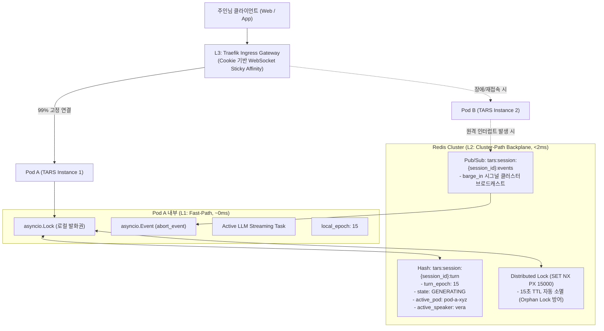
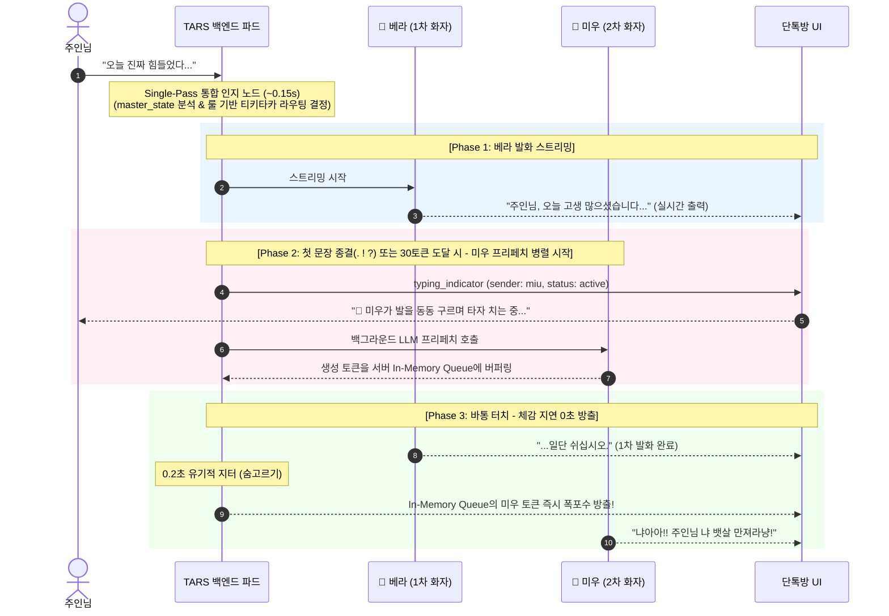
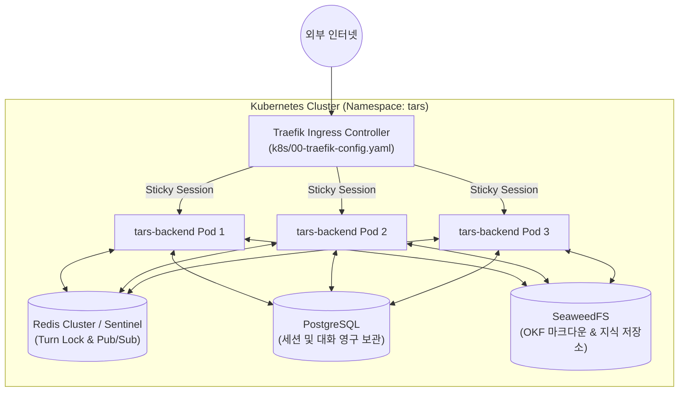

# TARS 인지형 자율 동반자 시스템 기획서 3부: 분산 런타임 & 실시간 인프라 아키텍처 (Distributed Runtime & Real-Time Infrastructure)

> *"초저지연의 착각은 정교한 인프라가 빚어낸 마술이다. 수많은 파드가 얽힌 클러스터 속에서도 두 메이드의 숨소리는 1밀리초의 어긋남 없이 단 하나의 단톡방으로 직결된다."*

---

## 1. 서론: 왜 인프라가 인지 경험의 성패를 가르는가?

### 1.1. 1부(내면), 2부(사회성), 그리고 3부(물리적 지탱)
* **1부 (인지의 내면)**: 무의식과 의식의 분리, 마음 이론(Theory of Mind), 감정의 유기적 관성.
* **2부 (사회적 역학)**: 듀얼 메이드 단톡방, 베라(System 2)와 미우(System 1)의 티키타카, 카톡 읽음 연출.
* **3부 (분산 런타임 & 인프라)**: **"이 모든 인지적 마법이 Kubernetes 다중 파드(`replicas: 3`) 환경에서 단 1밀리초의 레이스 컨디션도 없이 초저지연으로 작동하도록 지탱하는 물리적 뼈대."**

### 1.2. Kubernetes 다중 파드 환경이 던지는 3대 핵심 난제
1. **발화권 분산 경쟁 (Distributed Turn Race)**: 
   사용자 요청과 메이드들의 발화가 서로 다른 파드로 분산될 때, 동시성 락이 깨져 두 메이드가 말을 겹쳐 뱉거나 세션 상태가 꼬이는 현상.
2. **LLM RTT로 인한 어색한 침묵 (The Uncanny Silence)**: 
   1차 메이드가 말을 끝내고 2차 메이드가 LLM API를 호출하기까지 발생하는 1~2초간의 정적(Latency Gap).
3. **클러스터 단위 즉각 중단 실패 (Split-Brain Barge-in)**: 
   파드 A에서 베라가 스트리밍 중인데, 사용자의 "그만!" 요청이 파드 B로 인입되었을 때 파드 A의 스트리밍을 멈추지 못하는 문제.

---

## 2. L1/L2/L3 3계층 하이브리드 분산 턴 락 (Hybrid Distributed Turn Lock)

> **설계 철학**: "클라이언트 통신은 **0ms 로컬 직통(L1)**으로, 클러스터 안전망은 **2ms Redis 백플레인(L2)**으로, 물리적 트래픽은 **Ingress 스티키 라우팅(L3)**으로 격리한다."



### 2.1. 계층별 책임 및 동작 명세

| 계층 | 구성 요소 | 지연 시간 | 역할 및 책임 |
| :--- | :--- | :--- | :--- |
| **L1 (Fast-Path)** | `asyncio.Lock`<br/>`asyncio.Event`<br/>`turn_epoch` 검증 | **~0ms** (In-Memory) | - 파드 내부 초고속 동시성 제어<br/>- 50~150ms 급속 소켓 드롭 및 토큰 방출 중단<br/>- 불일치 세대 번호 잔여 패킷(Stale Chunk) 즉시 폐기 |
| **L2 (Cluster-Path)** | Redis Hash<br/>Redlock (`SET NX PX`)<br/>Redis Pub/Sub | **< 2ms** (In-Memory Network) | - 다중 파드 간 글로벌 `turn_epoch` 단조 증가 발급<br/>- 15초 TTL 워치독을 통한 고아 락(Orphan Lock) 방어<br/>- 어느 파드로 유입되든 인터럽트 신호 전 파드 브로드캐스트 |
| **L3 (Ingress-Path)** | Traefik Sticky Session<br/>(`sticky.cookie`) | **인프라 레벨** | - 사용자의 WebSocket 연결을 특정 파드에 99% 고정<br/>- 대부분의 트래픽이 L1 Fast-path를 타도록 보장 |

### 2.2. 세대 번호(Turn Epoch) 기반 분산 레이스 컨디션 방어
1. **발화권 획득 시**: Redis `HINCRBY tars:session:{session_id}:turn turn_epoch 1`을 원자적으로 실행하여 글로벌 단조 증가 세대 번호를 획득.
2. **스트리밍 도중**: 스트리밍 워커가 토큰 패킷을 클라이언트로 송출할 때마다 자신의 `packet.turn_epoch == self.local_epoch`를 검증.
3. **인터럽트 발생 시**: `local_epoch`가 즉시 증가하므로, 비동기 큐에 남아 날아오던 이전 태스크의 잔여 토큰은 조건문에서 걸러져 **1토큰도 클라이언트에 누출되지 않고 즉각 드롭**됨.

### 2.3. 고아 락(Orphan Lock) 방지 워치독
* 파드가 LLM 스트리밍 도중 Node 장애나 OOMKilled로 즉사하는 경우:
  - Redis 락 점유 시 `PX 15000` (15초 만료)를 강제.
  - 15초 후 Redis가 락 키를 자동 삭제하므로 클러스터 전체가 멈추는 **영구 교착 상태(Deadlock)가 원천 차단**됨.
  - 정상 스트리밍 중에는 3초 간격의 백그라운드 하트비트 루프가 TTL을 15초로 갱신(Renew)함.

---

## 3. 티키타카 오버랩 프리페칭 엔진 (Overlapped Prefetching Engine)

> **문제 정의**: 베라 발화 완료 $\rightarrow$ 0.3s 공백 $\rightarrow$ 미우 LLM API 호출 $\rightarrow$ **첫 토큰 대기 1.2초** = 카톡방에 1.5초간 어색한 침묵 발생.

### 3.1. 오버랩 파이프라이닝 메커니즘
1차 화자가 말을 끝내기를 기다리지 않고, **1차 화자가 한창 말하고 있는 도중에 백그라운드에서 2차 화자의 LLM을 미리 호출해 토큰을 내부 메모리 큐에 버퍼링**합니다.



#### 프리페치 발동 트리거의 공학적 조건
스트리밍 도중 전체 토큰 수를 사전에 예측하는 것은 불가능하므로, 시스템은 다음의 **결정론적 조건식(Deterministic Trigger)** 중 먼저 발생하는 시점에 2차 화자의 백그라운드 프리페치를 시작합니다:
1. **첫 번째 문장 종결 부호(`.`, `!`, `?`, `\n`) 감지 시**: 1차 화자가 첫 문장을 마치는 즉시 2차 화자의 LLM 스트리밍 호출 (가장 일반적인 대화 리듬).
2. **누적 30토큰 방출 시 (Fallback)**: 종결 부호 없이 장문이 이어지는 경우, 30토큰 도달 즉시 2차 화자 호출 시작.

### 3.2. 프리페칭 버퍼 관리 및 취소(GC) 파이프라인

```python
class PrefetchBufferQueue:
    """2차 화자의 선행 토큰을 임시 보관하고 원자적으로 방출/폐기하는 인메모리 큐."""
    def __init__(self, session_id: str, speaker: str, target_epoch: int) -> None:
        self.session_id = session_id
        self.speaker = speaker
        self.target_epoch = target_epoch
        self.queue: asyncio.Queue[str | None] = asyncio.Queue()
        self.is_aborted: bool = False
        self.prefetch_task: asyncio.Task[None] | None = None

    async def push_chunk(self, chunk: str) -> None:
        """프리페치된 토큰 청크를 큐에 버퍼링."""
        if not self.is_aborted:
            await self.queue.put(chunk)

    async def abort_and_discard(self) -> None:
        """Barge-in 발생 시 프리페치 태스크 즉시 취소 및 큐 폐기."""
        self.is_aborted = True
        if self.prefetch_task and not self.prefetch_task.done():
            self.prefetch_task.cancel()
        # 큐 비우기 (Garbage Collection)
        while not self.queue.empty():
            self.queue.get_nowait()
```

### 3.3. 급습 인터럽트(Barge-in) 시나리오 방어
* 1차 화자(베라)가 말하는 도중 사용자가 말을 끊었을 때:
  1. `HybridSessionTurnLock.trigger_barge_in()` 실행.
  2. 베라의 활성 스트리밍 태스크 취소.
  3. **백그라운드에서 프리페치 중이던 미우의 `PrefetchBufferQueue.abort_and_discard()` 즉시 호출**.
  4. 미우의 태스크는 취소되고 버퍼링된 토큰은 클라이언트에 단 1글자도 전송되지 않고 소멸.
  5. 소모된 LLM 비용은 수십 토큰 미만으로 극소화.

---

## 4. 분산 WebSocket 게이트웨이 & 카톡 프로토콜

### 4.1. Direct WebSocket Architecture (MQ 바이패스)
* **원칙**: 클라이언트와 백엔드 간에는 **Kafka, RabbitMQ, Redis Streams 같은 무거운 외부 브로커를 절대로 두지 않습니다.**
* **이유**: 실시간 토큰 스트리밍은 1초에 30~50회 이상의 작은 패킷이 방출되는데, 매 패킷마다 MQ를 거치면 오버헤드와 직렬화 비용으로 인해 TTFT(첫 토큰 시간)와 스트리밍 부드러움이 심각하게 저하됩니다.
* **해결책**:
  - 클라이언트 $\leftrightarrow$ 백엔드 Pod: **순수 직통 WebSocket (Latency 0ms)**
  - 백엔드 Pod $\leftrightarrow$ 백엔드 Pod: **Redis Pub/Sub (내부 제어 신호용, 트래픽 극소)**

### 4.2. 카톡 읽음 확인 분산 디스패치 (Read Receipt Protocol)
1. **발송 즉시**: 클라이언트는 로컬에서 노란 숫자 `2`를 즉각 렌더링.
2. **베라 즉시 읽음 (0.05s)**: 
   - 메시지를 수신한 Pod가 WebSocket으로 즉시 `{"type": "read_receipt", "reader": "vera", "unread_count": 1}` 방출.
3. **미우 시간차 읽음 (0.3s~0.5s Jitter)**:
   - 비동기 백그라운드 타이머(`asyncio.sleep(jitter)`) 후 `{"type": "read_receipt", "reader": "miu", "unread_count": 0}` 방출.
4. **동적 수신자 처리**:
   - `GroupChatMessage.recipients` 리스트를 기반으로 읽지 않은 메이드 수를 동적으로 계산하여 숫자를 2 $\rightarrow$ 1 $\rightarrow$ 사라짐으로 완벽 동기화.

### 4.3. 세션 재연결(Reconnection) 및 Pod 장애 복구 (Hydration)
* 지하철 진입 등으로 클라이언트 소켓이 끊어졌다가 1초 뒤 다른 파드(Pod B)로 붙은 경우:
  1. 클라이언트는 마지막으로 수신한 `last_message_id`를 헤더에 담아 재연결 요청.
  2. Pod B는 Redis의 `tars:session:{session_id}:turn` 해시를 조회하여 현재 턴 상태와 발화 주체를 즉시 복원(Hydration).
  3. Postgres DB에서 `last_message_id` 이후의 대화 로그를 읽어와 클라이언트에 동기화.
  4. 사용자는 끊김을 전혀 인지하지 못하고 대화를 지속.

---

## 5. Kubernetes 배포 구성 및 복원력 (Resilience)

### 5.1. 배포 토폴로지 (Deployment Topology)



### 5.2. Traefik Ingress 세션 어피니티 설정 스니펫

`k8s/05-ingress.yaml`에 Traefik Sticky Cookie 애노테이션을 적용하여 동일 단톡방 세션을 단일 파드로 유지합니다:

```yaml
apiVersion: networking.k8s.io/v1
kind: Ingress
metadata:
  name: tars-ingress
  namespace: tars
  annotations:
    traefik.ingress.kubernetes.io/router.entrypoints: websecure
    traefik.ingress.kubernetes.io/router.tls: "true"
    # WebSocket Sticky Session 어피니티 활성화
    traefik.ingress.kubernetes.io/service.sticky.cookie: "true"
    traefik.ingress.kubernetes.io/service.sticky.cookie.name: "TARS_SESSION_AFFINITY"
    traefik.ingress.kubernetes.io/service.sticky.cookie.secure: "true"
    traefik.ingress.kubernetes.io/service.sticky.cookie.httpOnly: "true"
spec:
  rules:
    - host: tars.local
      http:
        paths:
          - path: /api/v1/chat/ws
            pathType: Prefix
            backend:
              service:
                name: tars-backend-service
                port:
                  number: 8000
```

### 5.3. 그레이스풀 디그레이데이션 (Graceful Degradation)
* **Redis 장애 시 (Circuit Breaker)**:
  - Redis 연결이 끊어지면 시스템은 즉시 **L1 로컬 인메모리 모드로 자동 격리(Fallback)**.
  - 다중 파드 간 분산 동기화 기능은 일시 제한되지만, 개별 파드에 붙어있는 사용자의 대화는 중단 없이 지속.
  - 로그 및 메트릭에 `REDIS_BACKPLANE_DEGRADED` 경고를 기록하고 관리자에게 알림.

### 5.4. API 비용 및 토큰 가드레일 (Cost Guardrails)
1. **Single-Pass 통합 인지 노드**:
   - 무의식 분석과 Floor Director 발화권 판정을 1회 경량 호출로 번들링하여 **발화 결정 레이턴시를 0.15초로 단축하고 불필요한 에이전트 호출 차단**.
2. **미우 토큰 하드 캡**:
   - 미우(System 1)의 애교/딴지 대사는 시스템 프롬프트 및 파라미터에서 `max_tokens: 80`(공백 포함 50자 이내)으로 강제 제한하여 토큰 낭비 방지.
3. **프리페치 타임아웃**:
   - 1차 화자가 예상보다 길게 말하더라도 프리페치는 최대 5초까지만 대기하며, 초과 시 안전하게 취소.
4. **TTFT 및 레이턴시 가드레일**:
   - 1차 화자의 첫 토큰 스트리밍 시간(TTFT)은 **1.0초 이내**를 유지.
   - 2차 화자의 티키타카 전환은 인메모리 버퍼 큐를 통해 **0.2초 이내(숨고르기 지터 후 체감 0초)**로 방출하여 1.5초 이상의 어색한 침묵 원천 차단.

---

## 6. 단계별 인프라 구현 로드맵 (Milestones I1~I4)

| 마일스톤 | 명칭 | 핵심 산출물 및 엔지니어링 범위 |
| :--- | :--- | :--- |
| **I1** | **Redis 백플레인 & `HybridSessionTurnLock` 분산 인프라** | - 2부 M7의 결정론적 룰 엔진을 K8s 다중 파드 환경에서 지탱하는 Redis 분산 상태 해시 및 Redlock/PubSub 인터럽트 채널 구현<br/>- L1 로컬 락과 L2 Redis 락의 하이브리드 통합 드라이버 작성<br/>- 15초 Watchdog TTL 및 Orphan Lock 자동 복구 단위 테스트 |
| **I2** | **오버랩 프리페칭 & 스트리밍 버퍼 엔진** | - `PrefetchBufferQueue` 비동기 버퍼 큐 구현<br/>- 1차 화자 스트리밍 연동 및 2차 화자 선행 생성 오케스트레이터<br/>- Barge-in 인터럽트 시 프리페치 즉시 취소 및 버퍼 GC 검증 |
| **I3** | **분산 웹소켓 & 카톡 실시간 프로토콜** | - `/api/v1/chat/ws` 다자간 단톡방 이벤트 프로토콜 확장<br/>- `read_receipt` 2 $\rightarrow$ 1 $\rightarrow$ 0 시간차 지터 엔진<br/>- 겹침 타이핑 인디케이터(`typing_indicator`) 웹소켓 연출 |
| **I4** | **Traefik Sticky 연동 & K8s 분산 카오스 테스트** | - Traefik Sticky Ingress 매니페스트 적용<br/>- 파드 3대(`replicas: 3`) 환경에서 동시 발화 및 급습 인터럽트 스트레스 테스트<br/>- 파드 강제 종료(Kill) 시 세션 복원 및 고아 락 회수 E2E 검증 |
