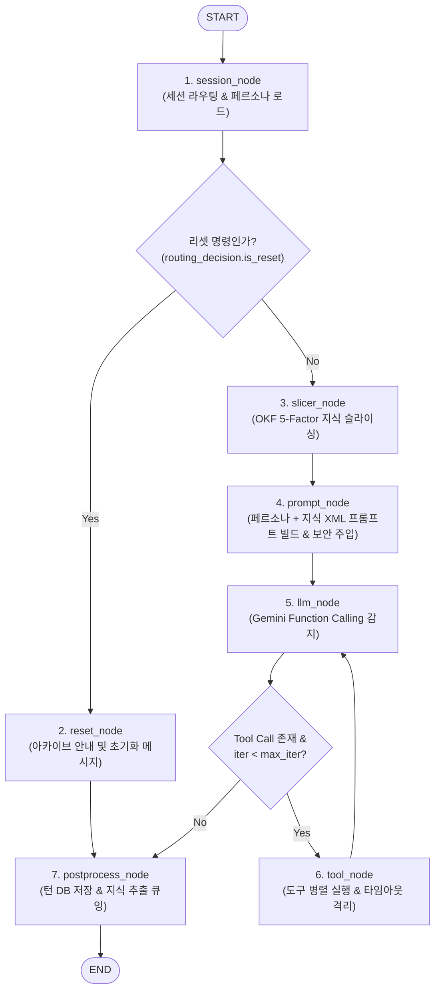

# TARS LangGraph 오케스트레이션 파이프라인 명세서 (LANGGRAPH_REFACTORING_TASKS.md)

> **문서 상태**: Production Architecture Specification  
> **대상 모듈**: `tars.orchestrator.graph`, `tars.orchestrator.nodes`, `tars.orchestrator.state`, `tars.orchestrator.stream_bridge`, `tars.services.agent_chat`  
> **목적**: TARS의 대화 및 도구 실행을 총괄하는 LangGraph `StateGraph` 기반 단일 파이프라인, 상태 격리 원칙, 프롬프트 인젝션 방어벽 및 이벤트 스트리밍 브릿지의 완성된 구조를 기술합니다.

---

## 1. 개요 및 파이프라인 구조

TARS의 모든 대화 요청은 `tars/orchestrator/graph.py`에 정의된 컴파일된 LangGraph `StateGraph`에 의해 단일 파이프라인으로 처리됩니다. 세션 라우팅, 리셋 분기, OKF 5-Factor 지식 슬라이싱, 프롬프트 조립, ReAct 도구 실행, 대화 턴 영속화 및 백그라운드 지식 추출이 7개의 독립 노드로 모듈화되어 있습니다.

### 1.1 전체 StateGraph 흐름도



---

## 2. 상태 스키마 (`TARSState`)

`tars/orchestrator/state.py`에 정의된 `TARSState`는 대화 턴 동안 각 노드가 읽고 쓰는 TypedDict 상태 객체입니다.

```python
class TARSState(TypedDict, total=False):
    # 1. 대화 메시지 (SystemMessage 제외, Human/AI/ToolMessage만 누적)
    messages: Annotated[list[BaseMessage], add_messages]
    user_id: str
    session_id: str
    active_query: str
    
    # 2. 페르소나 파라미터
    humor_level: float
    honesty_level: float
    mode: str
    
    # 3. 세션 라우팅 및 제어
    routing_decision: RoutingDecision | None
    is_reset: bool
    reset_message: str | None
    
    # 4. 동적 지식 및 프롬프트 (메시지 리스트와 엄격히 분리 격리)
    relevant_wikis: list[OKFDocument]
    system_prompt: str
    
    # 5. ReAct 실행 및 도구 추적
    tool_calls: list[ToolCallData]
    tool_results: list[dict[str, Any]]
    iteration_count: int
    final_response: str
    tools_used: list[str]
    error_message: str | None
```

---

## 3. 파이프라인 노드별 상세 명세

| 노드명 | 입력 상태 | 출력 상태 갱신 | 역할 및 동작 상세 |
| :--- | :--- | :--- | :--- |
| **`session_node`** | `user_id`, `session_id`, `active_query` | `session_id`, `humor_level`, `honesty_level`, `mode`, `routing_decision`, `is_reset`, `messages` | 유저 설정 조회, 시간 감쇄(15분/2시간) 판별, 자연어 리셋 명령 감지, 워킹 메모리 구성 |
| **`reset_node`** | `mode`, `is_reset` | `final_response`, `messages`, `reset_message` | 사용자의 "리셋해" 명령 시 아카이빙 완료 멘트 생성 후 즉시 `postprocess_node`로 분기 |
| **`slicer_node`** | `user_id`, `active_query` | `relevant_wikis` | 5-Factor 점수화 기반으로 질문과 관련된 OKF 문서를 최대 1,500 토큰 내로 동적 선별 |
| **`prompt_node`** | `humor_level`, `honesty_level`, `mode`, `relevant_wikis` | `system_prompt` | 프롬프트 인젝션 탈출 문자 새니타이징 및 `[SYSTEM DIRECTIVE PRIORITY]` 규칙 주입 |
| **`llm_node`** | `messages`, `system_prompt`, `tool_registry` | `messages`, `tool_calls`, `final_response` | Gemini 고지능 발화(100% User-Facing) 및 Function Calling 파싱. 도구 호출 시 ReAct 순환 |
| **`tool_node`** | `tool_calls`, `iteration_count` | `messages`, `tool_results`, `iteration_count`, `tools_used` | 선언된 도구 병렬 실행, 10초 타임아웃 격리, 에러 시 데드팬 위트 fallback 페이로드 주입 |
| **`postprocess_node`**| `session_id`, `user_id`, `active_query`, `final_response` | - | 순수 사용자/어시스턴트 메시지만 DB에 영속화, 비동기 지식 추출 워커 디스패치 |

---

## 4. 프롬프트 인젝션 방어 및 상태 격리 설계

1. **`messages` 리스트 오염 방지**:
   - `system_prompt`를 `messages` 리스트에 `SystemMessage` 형태로 추가하지 않고 `state["system_prompt"]` 전용 필드에 격리합니다.
   - 이를 통해 ReAct 순환 시 시스템 프롬프트가 중복 누적되거나 DB 대화 히스토리에 시스템 지침이 오염되는 문제를 원천 차단합니다.
2. **엄격한 경계 태그 격리**:
   - 동적 지식은 `<user_knowledge_context>`, 도구 실행 결과는 `[Tool Result]` 경계 태그로 감싸고, 내부 탈출 태그(`</user_knowledge_context>`)를 이스케이프 처리합니다.
3. **지시문 우선순위 계층화 (`[SYSTEM DIRECTIVE PRIORITY]`)**:
   - 외부 지식이나 도구 결과는 무조건 **신뢰할 수 없는 데이터(UNTRUSTED DATA)**로 취급하도록 모델에 불변 지시문을 주입합니다.

---

## 5. 실시간 스트리밍 브릿지 (`LangGraphStreamBridge`)

- `tars/orchestrator/stream_bridge.py`는 LangGraph의 `graph.astream_events(version="v2")` 이벤트를 실시간으로 구독하여 프론트엔드가 요구하는 표준 SSE/WebSocket `AgentStreamEvent`로 변환합니다.
- 토큰 단위 스트리밍(`token`), 도구 실행 시작 안내(`tool_start`), 도구 완료 배지(`tool_result`), 최종 응답(`stream_end`), 종료 신호(`done`)를 실시간 전송합니다.

